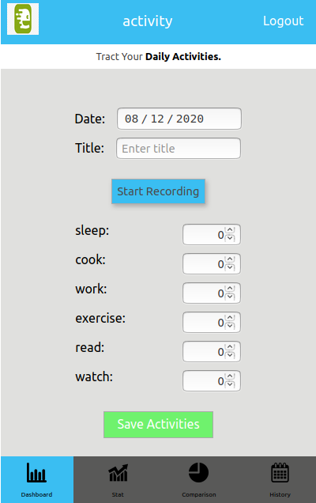
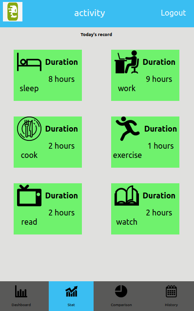

# ACTIVITY-TRACKER-APP
This is the final capstone project from the Microverse curriculum. The solo objective of this project is to give facility to individual user to record their daily records of various activities, access, and compare them to see their progress.

## [Live Demo](https://suman-activity-tracker.herokuapp.com/)

## Features of the project
- Connected with RESTful rails API to get and store data.
- Session based authentication.
- Redux store is created to store data.
- React-routing is used to create routing.
- Redux-thunk for asynchronous API call.

## Screenshots
  
  

## Languages and packages used
- React
- Redux
- CSS modules
- Ruby on Rails(backend)

## How to install the project?
- Clone the repository 'https://github.com/sumancrest0001/Activity-tracker-app.git'

- Navigate to the project file using 'cd Activity-tracker-app'

- Install node modules using 'npm install'

- Run the project on local server using 'npm start'

- Enjoy the project and feel free to play with the code.

## Author

Suman shrestha
- [github](https://github.com/sumancrest0001)
- [LinkedIn](https://www.linkedin.com/in/suman-shrestha0001/)
- [Personal-site](https://sumancrest0001.github.io/portfolio/)

## Future improvements
- [ ] Work on the compare page and show the result by comparing today's record with past records.
- [ ] Make it responsive.

- [ ] Possibly add graphs and charts using D3.js.

## Show your support

Give a ⭐️ if you like this project!

## 🤝  Contribution
To contribute to the project. Please create an issue.

## NOTE 
Comparison page is under progress.

## MIT Licensed
